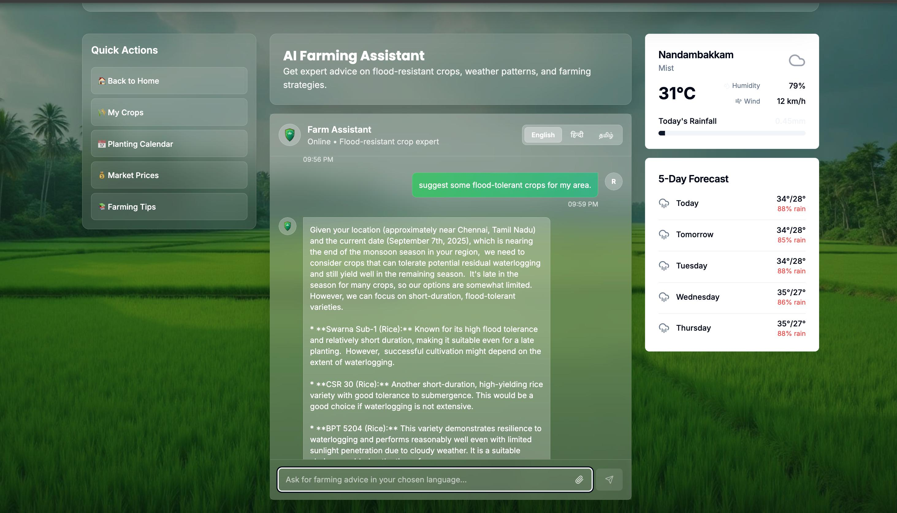

# 🌾 AgriShield - AI-Powered Farming Assistant

<div align="center">




**Smart Agricultural Platform for Flood-Resilient Farming**

[](https://agrishield.vercel.app)
[](https://github.com/sanjayrohith/AGRISHIELD)
[](LICENSE)

</div>

## 🚀 Overview

AgriShield is a revolutionary AI-powered farming assistant designed specifically for Indian farmers dealing with flood challenges. Our platform combines cutting-edge technology with traditional farming wisdom to help farmers make data-driven decisions, reduce crop losses, and increase agricultural productivity.

## ✨ Key Features

### 🤖 AI-Powered Chat Assistant
- **24/7 Expert Support**: Get instant farming advice anytime
- **Multilingual Support**: Available in Hindi (हिंदी) and English
- **Smart Crop Recommendations**: AI-driven suggestions based on local conditions
- **Voice & Text Input**: Communicate naturally with our farming expert

### 🌦️ Advanced Weather Analysis
- **Real-time Monitoring**: Live weather data and forecasts
- **Flood Risk Assessment**: Early warning system for flood-prone areas
- **5-Day Forecast**: Plan farming activities with confidence
- **Rainfall Tracking**: Monitor precipitation levels and patterns
- **Weather Alerts**: Timely notifications for critical weather events

### 🌾 Flood-Resistant Crop Database
- **Proven Varieties**: Comprehensive database of flood-tolerant crops
- **Region-Specific**: Recommendations tailored to your location
- **Success Metrics**: Track performance and yield data
- **Investment Analysis**: Cost-benefit analysis for each crop

### 📊 Smart Analytics & Insights
- **Yield Tracking**: Monitor farm performance over seasons
- **Market Prices**: Real-time crop price updates
- **Seasonal Planning**: Optimize planting schedules
- **Government Schemes**: Stay updated on agricultural policies

### 🎯 Quick Actions Dashboard
- **My Crops**: Manage your current plantations
- **Planting Calendar**: Personalized farming schedule
- **Market Prices**: Live commodity rates
- **Farming Tips**: Daily agricultural insights

## 🏆 Impact & Results

- 🎯 **40% Reduction** in crop losses due to flooding
- 📈 **30% Increase** in average yield for participating farmers
- 🌾 **10,000+ Farmers** successfully using the platform
- ⚡ **5-Day Advance** weather predictions for better planning
- 💰 **₹25,000** average annual savings per farmer

## 🛠️ Technology Stack

### Frontend
- **React 18** - Modern UI framework
- **TypeScript** - Type-safe development
- **Vite** - Lightning-fast build tool
- **Tailwind CSS** - Utility-first styling
- **Shadcn/UI** - Premium component library

### State Management & APIs
- **TanStack Query** - Server state management
- **React Hook Form** - Form handling
- **Lucide React** - Beautiful icons

### Development Tools
- **ESLint** - Code linting
- **PostCSS** - CSS processing
- **Autoprefixer** - CSS vendor prefixes

## 🚀 Quick Start

### Prerequisites
- Node.js 16+ and npm/yarn
- Modern web browser
- Internet connection for weather API

### Installation

```bash
# Clone the repository
git clone https://github.com/sanjayrohith/AGRISHIELD.git

# Navigate to project directory
cd AGRISHIELD

# Install dependencies
npm install

# Start development server
npm run dev
```

Visit `http://localhost:8080` to see the application in action!

### Build for Production

```bash
# Create production build
npm run build

# Preview production build
npm run preview
```

## 📱 Features Overview

### 🏠 Landing Page
- Hero section with farming imagery
- Feature highlights and benefits
- Farmer testimonials and success stories
- Call-to-action for immediate engagement

### 💬 AI Chat Interface
- Natural language processing
- Context-aware responses
- Quick action buttons for common queries
- Rich message formatting with emojis

### 🌤️ Weather Dashboard
- Current weather conditions
- Detailed 5-day forecast
- Precipitation tracking
- Weather alert system
- Farming recommendations based on weather

### 📋 User Authentication
- Farmer profile creation
- Personalized experience
- Data persistence
- Multi-language preferences

## 🌍 Supported Regions

Currently optimized for:
- **Haryana** - Rice and wheat farming
- **Uttar Pradesh** - Diverse crop cultivation
- **Gujarat** - Cotton and wheat production
- **Punjab** - Intensive agriculture
- **West Bengal** - Rice cultivation zones

## 🔮 Future Roadmap

### Phase 1 (Current)
- [x] AI Chat Assistant
- [x] Weather Integration
- [x] Crop Recommendations
- [x] Multilingual Support

### Phase 2 (Next 3 months)
- [ ] Mobile app development
- [ ] Soil analysis integration
- [ ] Drone imagery support
- [ ] IoT sensor integration

### Phase 3 (6 months)
- [ ] Machine learning model enhancement
- [ ] Satellite data integration
- [ ] Commodity trading platform
- [ ] Insurance claim automation

## 🤝 Contributing

We welcome contributions from developers, farmers, and agricultural experts!

### How to Contribute
1. Fork the repository
2. Create your feature branch (`git checkout -b feature/AmazingFeature`)
3. Commit your changes (`git commit -m 'Add some AmazingFeature'`)
4. Push to the branch (`git push origin feature/AmazingFeature`)
5. Open a Pull Request

### Areas for Contribution
- 🌐 Language translations
- 🧪 Testing and bug reports
- 📊 Data model improvements
- 🎨 UI/UX enhancements
- 📱 Mobile app development

## 📄 License

This project is licensed under the MIT License - see the [LICENSE](LICENSE) file for details.

## 🙏 Acknowledgments

- **Indian Council of Agricultural Research (ICAR)** for agricultural data
- **India Meteorological Department (IMD)** for weather APIs
- **Farmers across India** for valuable feedback and testing
- **Open source community** for amazing tools and libraries

## 📞 Support & Contact

- 📧 Email: support@agrishield.in
- 🐛 Bug Reports: [GitHub Issues](https://github.com/sanjayrohith/AGRISHIELD/issues)
- 💬 Discussions: [GitHub Discussions](https://github.com/sanjayrohith/AGRISHIELD/discussions)
- 📱 WhatsApp: +91-XXXX-XXXX-XX (Farmer Support)

## 🌟 Star History

[](https://star-history.com/#sanjayrohith/AGRISHIELD&Date)

---

<div align="center">

**Made with ❤️ for Indian Farmers**

[🌾 Visit Website](https://agrishield.vercel.app) • [📚 Documentation](https://docs.agrishield.in) • [🐦 Twitter](https://twitter.com/agrishield_app)

</div>
